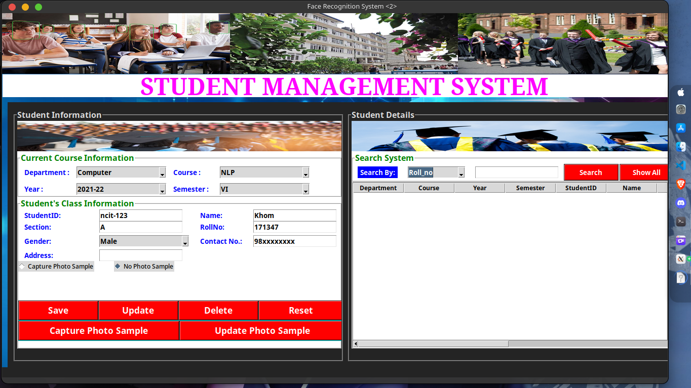

# Face-Recognition-Based-Student-Attendance-System-in-Python-using-OpenCV-with-Tkinter-GUI-

### Team Kyzen
* [Amish Thapa](https://github.com/amish-git)
* [Keshav Raj Poudel](https://github.com/Keshav-46)
* [Khom Raj Thapa Magar](https://khomz.github.io/)

[[Click me!]](https://khomz.github.io/)

### Abstract
Face recognition-based attendance system is a process of recognizing the faces of the students while taking attendance by using face bio-metrics based on high – definition monitor video and other information technology. In this face recognition project, a computer system will be able to find and recognize human faces quickly and precisely in images or videos that are being captured through a webcam / a surveillance camera. 
In our face recognition project, a computer system will be able to find and recognize human faces quickly and precisely in images or videos that are being captured through a webcam / surveillance camera. 
Here, faces will recognized using face recognition algorithm. The processed image will then be compared against the existing record and then attendance marked in the database accordingly. The human face is the most distinctive feature used to uniquely identify an individual. That's why, it is used to trace identity as the possibilities for a face to deviate or being duplicated is low.

### Problem Statement
The biggest issue in former attendance management system is the accuracy of the data collected. This is because the attendance might not be recorded personally by the original person, in other word, the attendance of a particular person can be taken by a third party without the realization of the institution which violates the accuracy of the data. 

#### To do:
* Record Student Details in a Database
* Train Photo samples of the students
* 

### Algorithms Used
* Haarcascade OpenCV(Face Detection)
* LBPH OpenCV(Face Recognition)

### Project Features
#### 1. Login Security System
* (Username & Password)
#### 2. Homepage
* Student Management System
* Train Photo Samples
* Take Attendance with Face Detection
* Attendance Report (.csv file & Sqlite database)
* Developer Page(Team Kyzen)
* Help Desk
* Exit System

### Snapshots

### HomePage

### Student Management System

### Training

### Recoginition

### Built With
* Python
* OpenCV
* tkinter

